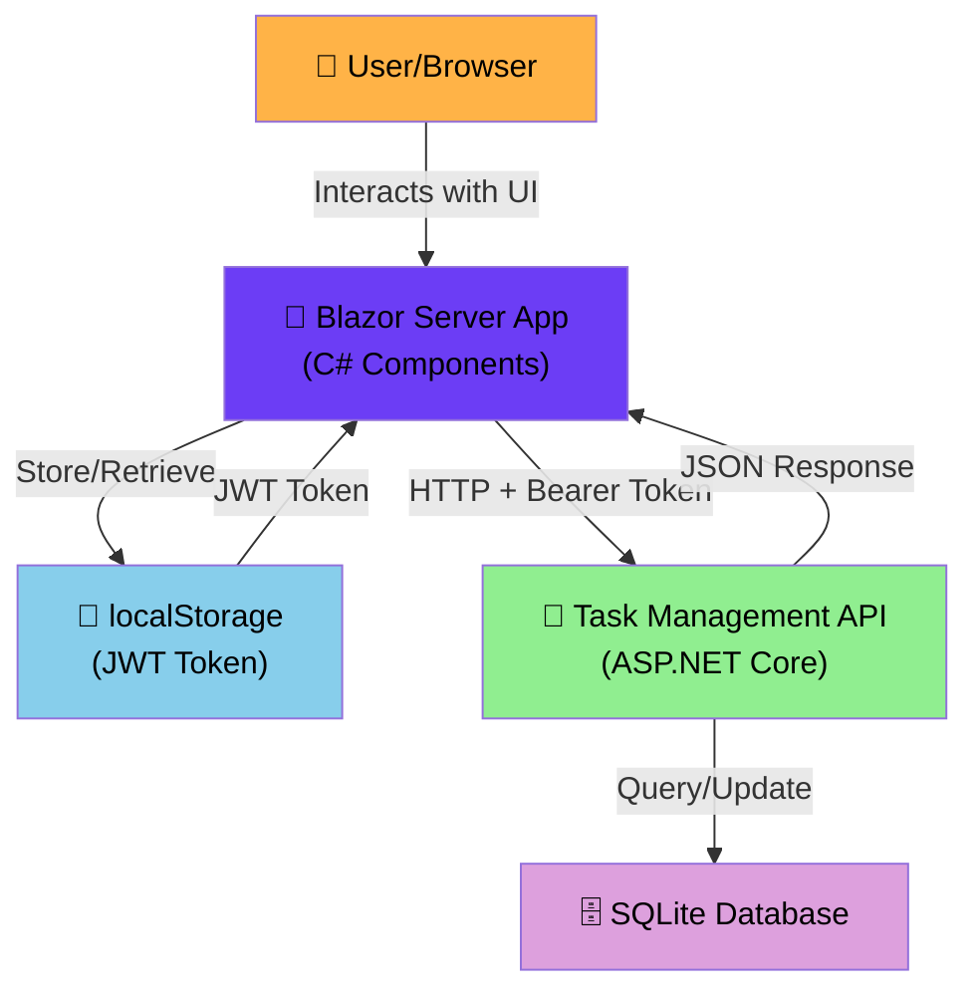
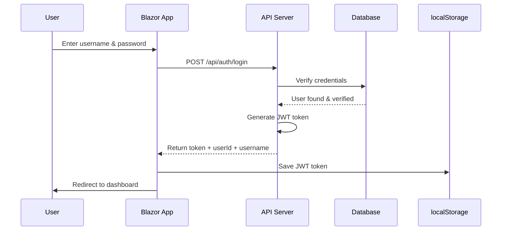
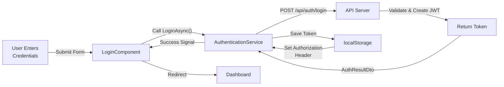
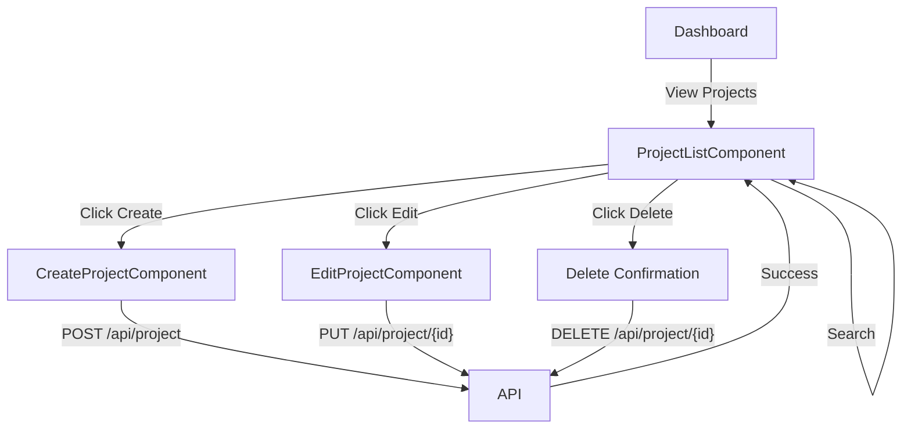

# Task Management API - Part 2: Detailed Implementation Plan

## Table of Contents

1. [Project Overview](#project-overview)
2. [Technology Stack & Architecture](#technology-stack--architecture)
3. [Project Structure](#project-structure)
4. [Stage 1: Project Preparation & Understanding](#stage-1-project-preparation--understanding)
5. [Stage 2: Blazor Frontend - Authentication Module](#stage-2-blazor-frontend---authentication-module)
6. [Stage 3: Blazor Frontend - Project Management Module](#stage-3-blazor-frontend---project-management-module)
7. [Stage 4: Blazor Frontend - Task Management Module](#stage-4-blazor-frontend---task-management-module)
8. [Stage 5: Blazor Frontend - UI/UX Polish](#stage-5-blazor-frontend---uiux-polish)
9. [Stage 6: Comprehensive API Testing](#stage-6-comprehensive-api-testing)
10. [Stage 7: Project Documentation](#stage-7-project-documentation-0--100)
11. [Stage 8: Implementation Status & Updates](#-stage-8-implementation-status--recent-updates)

---

## Project Overview

### Purpose
Develop a Blazor Server-side web application that serves as a frontend for the exiting Task Management API (Part 1). The application will allow authenticated users to manage their projects and tasks through an intuitive user interface. Additionally, it will expand the existing test coverage to achieve ~100% coverage on all custom controllers. Then provide the comprehensive project documentation to allow both censors and other devs understand the project's lifecycle. 

### Scope
- **Blazor Frontend**: Complete CRUD operations for projects and tasks
- **Authentication**: Login/logout with JWT token management
- **Testing**: Comprehensive test coverage for API controllers
- **Documentation**: Code explanations, test setup, and personal reflection

### Key stages
- **Milestone 1**: Blazor project setup + authentication (Week 1)
- **Milestone 2**: Project & Task CRUD implementation (Week 2)
- **Milestone 3**: UI/UX polish + testing (Week 3)
- **Milestone 4**: Documentation + delivery (Week 4)

---

## Technology Stack & Architecture

### Confirmed Technology Choices

```
Frontend:
  ├── Blazor Server (ASP.NET Core 8)
  ├── HttpClient (C#-based HTTP communication)
  └── localStorage (JWT token persistence)

Backend (Already Complete):
  ├── ASP.NET Core 8 Web API
  ├── Entity Framework Core (SQLite)
  ├── JWT Authentication (Bearer tokens)
  └── Service Layer Pattern with Ownership Enforcement

Testing:
  ├── xUnit (existing)
  ├── In-memory SQLite database
  └── FakeUserContext for mocking

Communication:
  ├── HTTP/HTTPS requests
  ├── JWT Bearer token in Authorization header
  └── JSON request/response bodies
```

### Architecture Diagram



### Data Flow Example: Login Process



---

## Project Structure

### Solution Layout After Part 2 Completion

```
TaskManagementAPI/
│
├── TaskManagementAPI/                    (Existing API Project)
│   ├── Controllers/
│   │   ├── AuthController.cs
│   │   ├── ProjectController.cs
│   │   ├── TaskController.cs
│   │   └── CommentController.cs
│   ├── Models/
│   ├── Services/
│   ├── DTOs/
│   ├── Data/
│   ├── Migrations/
│   └── Program.cs
│
├── TaskManagementAPI.Tests/              (Existing Test Project)
│   ├── Controllers/
│   │   ├── ProjectControllerTests.cs     (Will expand)
│   │   ├── TaskControllerTests.cs        (Will expand)
│   │   └── CommentControllerTests.cs     (Will expand)
│   ├── Helpers/
│   ├── AuthControllerTests.cs            (NEW - for ~100% coverage)
│   └── TaskManagementAPI.Tests.csproj
│
├── TaskManagementAPI.Blazor/             (NEW - Blazor Project)
│   ├── Components/
│   │   ├── Auth/
│   │   │   ├── LoginComponent.razor
│   │   │   └── LogoutButton.razor
│   │   ├── Projects/
│   │   │   ├── ProjectListComponent.razor
│   │   │   ├── ProjectDetailComponent.razor
│   │   │   ├── CreateProjectComponent.razor
│   │   │   └── EditProjectComponent.razor
│   │   ├── Tasks/
│   │   │   ├── TaskListComponent.razor
│   │   │   ├── TaskDetailComponent.razor
│   │   │   ├── CreateTaskComponent.razor
│   │   │   ├── EditTaskComponent.razor
│   │   │   └── TaskStatusComponent.razor
│   │   ├── Layout/
│   │   │   ├── MainLayout.razor
│   │   │   ├── Navbar.razor
│   │   │   └── Sidebar.razor
│   │   └── Shared/
│   │       ├── LoadingSpinner.razor
│   │       ├── ErrorAlert.razor
│   │       └── SuccessToast.razor
│   ├── Services/
│   │   ├── IApiClient.cs
│   │   ├── ApiClient.cs
│   │   ├── AuthenticationService.cs
│   │   ├── ProjectApiService.cs
│   │   ├── TaskApiService.cs
│   │   └── LocalStorageService.cs
│   ├── Pages/
│   │   ├── Dashboard.razor
│   │   ├── ProjectPage.razor
│   │   └── TaskPage.razor
│   ├── wwwroot/
│   │   ├── css/
│   │   │   ├── app.css
│   │   │   └── bootstrap-custom.css
│   │   └── js/
│   ├── App.razor
│   ├── Program.cs
│   └── TaskManagementAPI.Blazor.csproj
│
├── IMPLEMENTATION_PLAN_PART2.md          (This file)
├── TaskManagementAPI.sln
└── README.md
```

### File Creation Checklist

- [ ] **Blazor Project**: `TaskManagementAPI.Blazor` (new)
- [ ] **Components**: 10+ Razor components (Auth, Projects, Tasks, Layout)
- [ ] **Services**: 5-6 C# service classes for API communication
- [ ] **Pages**: 3 main pages (Dashboard, Projects, Tasks)
- [ ] **Tests**: Additional test classes for AuthController
- [ ] **Configuration**: appsettings.json, Program.cs setup
- [ ] **Styling**: Basic CSS for user-friendly interface

---

## Stage 1: Project Preparation & Understanding

### Overview
In this stage, you'll set up the Blazor project infrastructure, understand the API endpoints, and prepare your development environment.

### Objectives
- Create a new Blazor Server project within the solution
- Review and document all API endpoints
- Understand JWT token flow and storage requirements
- Set up project dependencies and configuration
- Create the foundation for API communication

### Tasks

#### Task 1.1: Create Blazor Server Project

**What to do:**
Create a new Blazor Server project targeting .NET 8 and add it to your solution.

**Commands to run:**

```bash
# Navigate to your project root
cd D:\StudioProjects\TaskManagementAPI

# Create new Blazor Server project
dotnet new blazor --interactivity Server --output TaskManagementAPI.Blazor --auth None

# Add project to solution
dotnet sln add .\TaskManagementAPI.Blazor\TaskManagementAPI.Blazor.csproj
```

**Expected Output:**
- New folder: `TaskManagementAPI.Blazor/`
- Files: `App.razor`, `Program.cs`, `appsettings.json`, `.csproj`, etc.
- Project should appear in Visual Studio Solution Explorer

**Verification:**
```bash
# Verify the project builds
dotnet build
```

✅ **Completion Criteria**: No build errors, project appears in solution explorer. COMPLETED.

---

#### Task 1.2: Add Required NuGet Packages to Blazor Project

**What to do:**
Add necessary packages for HTTP communication, local storage, and JWT token handling.

**Packages to add:**

| Package | Version | Purpose |
|---------|---------|---------|
| `Blazored.LocalStorage` | Latest | Browser localStorage access in Blazor |
| `System.IdentityModel.Tokens.Jwt` | 7.* | JWT token parsing |
| `Microsoft.AspNetCore.Components.Authorization` | 8.* | Built-in (should exist) |

**Commands to run:**

```bash
cd TaskManagementAPI.Blazor

# Add local storage package
dotnet add package Blazored.LocalStorage

# Add JWT package (if not already present)
dotnet add package System.IdentityModel.Tokens.Jwt

# Restore all dependencies
dotnet restore
```

**Expected Output:**
- Packages added to `TaskManagementAPI.Blazor.csproj`
- No dependency conflicts

✅ **Completion Criteria**: Packages installed successfully, no warnings

---

#### Task 1.3: Create API Endpoint Reference Document

**What to do:**
Create a local reference document listing all API endpoints with their request/response formats.

**File to create:** `TaskManagementAPI.Blazor/API_ENDPOINTS_REFERENCE.md`

**Details:** See the created file `TaskManagementAPI.Blazor/API_ENDPOINTS_REFERENCE.md` in your project

**Reference this document:**
- Base URL configuration
- All authentication endpoints (register, login)
- All project endpoints (CRUD, search)
- All task endpoints (CRUD, status, assign)
- Error response formats
- HTTP status codes

✅ **Completion Criteria**: Reference document created and accessible in project

---

#### Task 1.4: Create Local Development Configuration

**What to do:**
Update Blazor project configuration to communicate with the API.

**Files to create/modify:**
- `TaskManagementAPI.Blazor/appsettings.json`
- `TaskManagementAPI.Blazor/appsettings.Development.json`

**Configuration includes:**
- API base URL: `http://localhost:5114` (UPDATED - was localhost:5001)
- Request timeout: 30 seconds
- Logging levels (Information for prod, Debug for dev)

**IMPORTANT:** The API runs on port 5114 (configured in Properties/launchSettings.json), not 5001.

**See the created files** in your project folder.

**Completion Criteria**: Configuration files created/updated with proper settings. COMPLETED  
✅ **STATUS: UPDATED** - Fixed API base URL to match actual API port (5114)

---

#### Task 1.5: Create Base API Client Service

**What to do:**
Create a foundational service class for making HTTP calls to the API with JWT token handling.

**Files to create:**
- `TaskManagementAPI.Blazor/Services/IApiClient.cs` (Interface)
- `TaskManagementAPI.Blazor/Services/ApiClient.cs` (Implementation)

**Key responsibilities:**
- Retrieve JWT token from localStorage on EVERY request (NOT stored in HttpClient headers)
- Handle GET, POST, PUT, PATCH, DELETE requests
- Deserialize JSON responses to typed objects
- Log requests and errors
- Handle HTTP error responses with proper exceptions

**Key methods:**
- `SetTokenAsync(string token)` - Save token to localStorage
- `ClearTokenAsync()` - Remove token from localStorage
- `GetAsync<T>(string endpoint)` - GET request (retrieves token per request)
- `PostAsync<T>(string endpoint, object body)` - POST request (retrieves token per request)
- `PutAsync<T>(string endpoint, object body)` - PUT request (retrieves token per request)
- `PatchAsync<T>(string endpoint, object body)` - PATCH request (retrieves token per request)
- `DeleteAsync(string endpoint)` - DELETE request (retrieves token per request)

**CRITICAL IMPLEMENTATION DETAILS:**
- `CreateRequestWithAuthAsync()` helper method retrieves token from localStorage and adds Authorization header to each individual request
- This solves the issue where different HttpClient instances would not share the token
- ApiClient now depends on `ILocalStorageService` to access token storage

**See the created files** in your `Services/` folder.

✅ **Completion Criteria**: IApiClient interface and ApiClient implementation created and compile without errors  
✅ **STATUS: UPDATED** - ApiClient refactored to retrieve token from localStorage on every request

---

#### Task 1.6: Summary & Next Steps

**What you've accomplished:**
- Created new Blazor Server project
- Added necessary NuGet packages
- Created API endpoint reference document
- Configured appsettings for API communication
- Created base ApiClient service for HTTP communication

**Checkpoint:**
- Verify build succeeds: `dotnet build`
- Verify no compilation errors
- All files are created and in place

**Next in Stage 2:**
- Create Authentication Service
- Create Login/Logout components
- Implement JWT token storage in localStorage
- Create route protection

---

## Stage 2: Blazor Frontend - Authentication Module

### Overview
Implement complete authentication flow: login page, JWT token management, secure storage, and session handling.

### Objectives
- Create login and registration pages
- Implement authentication service with API calls
- Handle JWT token storage in localStorage
- Create logout functionality
- Protect routes with authentication check

### Dependencies
- IApiClient (from Stage 1)
- Blazored.LocalStorage package

### Key Concepts

#### JWT Token Flow in Blazor


#### localStorage Usage
```csharp
// Save token after successful login
await localStorageService.SetItemAsync("authToken", token);

// Retrieve token on app startup
var token = await localStorageService.GetItemAsync<string>("authToken");

// Remove token on logout
await localStorageService.RemoveItemAsync("authToken");
```

### Tasks

#### Task 2.1: Create Authentication Service

**File to create:** `TaskManagementAPI.Blazor/Services/AuthenticationService.cs`

**Key responsibilities:**
- Register new users (POST to `/api/auth/register`)
- Login existing users (POST to `/api/auth/login`)
- Logout users (clear token via ApiClient)
- Initialize authentication on app startup (check for token in localStorage)
- Check if user is authenticated
- Get current user's token

**Key methods:**
- `RegisterAsync(username, email, password)` - User registration
- `LoginAsync(username, password)` - User login
- `LogoutAsync()` - User logout (calls ApiClient.ClearTokenAsync())
- `InitializeAsync()` - Check token existence on app startup (simplified)
- `IsAuthenticatedAsync()` - Check if authenticated
- `GetTokenAsync()` - Get current token
- `GetCurrentUsernameAsync()` - Decode and return username from JWT token

**Event:**
- `OnAuthStateChanged` - Event fired when authentication state changes (notify other components)

**Request/Response models:**
- `RegisterRequest` - Registration request (username, email, password)
- `LoginRequest` - Login request (username, password)
- `AuthResultDto` - API response (token, userId, username)
- `AuthResult` - Result object for operations (success, message, user details)

**IMPORTANT IMPLEMENTATION CHANGES:**
- Token storage is now handled by ApiClient.SetTokenAsync() (which saves to localStorage)
- AuthenticationService no longer duplicates token storage
- InitializeAsync() simplified - only checks token existence, doesn't need to restore to HttpClient
- ApiClient retrieves token from localStorage on every request automatically

**See the created file** in your `Services/` folder.

**Completion Criteria**: AuthenticationService created and compiles without errors  
✅ **STATUS: UPDATED** - Simplified token management, removed duplicate localStorage calls

---

#### Task 2.2: Create DTOs and Models Folder

**What to do:**
Create a Models folder structure in the Blazor project for data classes.

**Create folder:** `TaskManagementAPI.Blazor/Models/`

**Files to create:**
- `TaskManagementAPI.Blazor/Models/AuthModels.cs`

**Models included:**
- `AuthResultDto` - Authentication response from API (token, userId, username)
- `LoginDto` - Login request data (username, password)
- `RegisterDto` - Registration request data (username, email, password)

**See the created file** in your `Models/` folder.

✅ **Completion Criteria**: Models folder and files created

---

#### Task 2.3: Register Services in Program.cs

**What to do:**
Register all new services in Blazor's dependency injection container.

**File to modify:** `TaskManagementAPI.Blazor/Program.cs`

**Services to register:**
- `AddAuthorizationCore()` - Enable authorization
- `AddCascadingAuthenticationState()` - Share auth state across components
- `AddBlazoredLocalStorage()` - Enable localStorage access
- `AddHttpClient<IApiClient, ApiClient>()` - Typed HttpClient with base address configured (UPDATED)
- `AuthenticationService` (scoped)
- `ProjectApiService` (scoped)
- `TaskApiService` (scoped)

**Configuration details:**
- Base URL: http://localhost:5114 (from appsettings.json ApiSettings:BaseUrl)
- Uses typed HttpClient pattern to ensure consistent token handling
- Scoped lifetime for services (new instance per request)

**IMPORTANT CHANGES:**
- Changed from `AddScoped<HttpClient>` to `AddHttpClient<IApiClient, ApiClient>()` to fix token persistence issues
- ApiClient now retrieves JWT token from localStorage on EVERY request (not stored in HttpClient headers)
- Base URL read from configuration section "ApiSettings:BaseUrl"
- Also added "ApiSettings" section to main `appsettings.json` in API project root

**See the file** in your project root for implementation details.

**Completion Criteria**: Program.cs updated with service registrations  
✅ **STATUS: UPDATED** - Fixed HttpClient registration to use typed client pattern

---

#### Task 2.4: Add ApiSettings to Main appsettings.json

**What to do:**
Add ApiSettings configuration section to the main API project's appsettings.json

**File to modify:** `TaskManagementAPI/appsettings.json`

**Configuration to add:**
```json
"ApiSettings": {
  "BaseUrl": "http://localhost:5114"
}
```

**Why needed:**
- Program.cs reads BaseUrl from configuration: `builder.Configuration.GetSection("ApiSettings")["BaseUrl"]`
- Ensures consistent API endpoint across development and production
  
**Completion Criteria**: ApiSettings section added to main appsettings.json  
✅ **STATUS: COMPLETED** - Configuration section added

---

#### Task 2.4: Create Login Component

**What to do:**
Create a Razor component for user login.

**File to create:** `TaskManagementAPI.Blazor/Components/Auth/LoginComponent.razor`

**Component features:**
- Login form with username and password fields
- Form validation using `EditForm` and `DataAnnotationsValidator`
- Error message display
- Loading spinner during authentication
- Submit button that calls `AuthenticationService.LoginAsync()`
- Navigation to dashboard on successful login
- Link to registration page

**Layout:**
- Centered card layout with purple gradient background
- Professional styling with Bootstrap classes
- Responsive design

**See the created file** in your `Components/Auth/` folder.

✅ **Completion Criteria**: LoginComponent created and syntax is valid

---

#### Task 2.5: Create Registration Component

**File to create:** `TaskManagementAPI.Blazor/Components/Auth/RegisterComponent.razor`

**Component features:**
- Registration form with username, email, and password fields
- Form validation
- Error message display
- Loading spinner during registration
- Submit button that calls `AuthenticationService.RegisterAsync()`
- Navigation to dashboard on successful registration
- Link to login page

**Layout:**
- Centered card layout with purple gradient background
- Professional styling with Bootstrap classes
- Responsive design
- Similar styling to LoginComponent for consistency

**See the created file** in your `Components/Auth/` folder.

✅ **Completion Criteria**: RegisterComponent created and syntax is valid. COMPLETED

---

#### Task 2.6: Critical Bug Fixes - Authentication & Prerendering Issues

**CRITICAL ISSUES DISCOVERED & RESOLVED:**

**Issue 1: JWT Token Not Persisting Between Requests (401 Unauthorized)**
- **Problem**: After successful login, subsequent API requests returned 401 Unauthorized
- **Root Cause**: HttpClient instances were created per-scope, token set on one instance wasn't available on others
- **Solution Applied**:
  - Refactored `ApiClient` to retrieve JWT token from localStorage on EVERY request
  - Changed from storing token in `HttpClient.DefaultRequestHeaders` to creating individual requests with token
  - Added `CreateRequestWithAuthAsync()` helper method in ApiClient
  - Updated `Program.cs` to use typed HttpClient pattern: `AddHttpClient<IApiClient, ApiClient>()`
  - Simplified AuthenticationService to avoid duplicate token storage

**Issue 2: JavaScript Interop Error During Prerendering**
- **Problem**: "JavaScript interop calls cannot be issued at this time" error when navigating to detail pages
- **Root Cause**: Blazored.LocalStorage requires JavaScript, which isn't available during server-side prerendering
- **Solution Applied**:
  - Added `@rendermode @(new InteractiveServerRenderMode(prerender: false))` to ALL page components
  - Added `@using Microsoft.AspNetCore.Components.Web` where needed for InteractiveServerRenderMode
  - Components affected: All project and task CRUD pages (List, Create, Edit, Detail)

**Issue 3: Duplicate Attribute Error in TaskListComponent**
- **Problem**: Build error - `@bind` and `@onchange` both used on search input
- **Solution**: Changed to `@bind-value` with `@bind-value:event="oninput"` and separate `@onchange`

**Files Modified:**
-  `ApiClient.cs` - Complete refactor for per-request token retrieval
-  `AuthenticationService.cs` - Simplified token management
-  `Program.cs` - Fixed HttpClient registration
-  `appsettings.json` - Fixed API base URL (5114)
-  `MainLayout.razor` - Added AuthService.InitializeAsync() call
-  `ProjectDetailComponent.razor` - Added rendermode directive
-  `CreateProjectComponent.razor` - Added rendermode directive
-  `EditProjectComponent.razor` - Added rendermode directive
-  `TaskListComponent.razor` - Added rendermode directive + fixed bind attribute
-  `TaskDetailComponent.razor` - Added rendermode directive
-  `CreateTaskComponent.razor` - Added rendermode directive
-  `EditTaskComponent.razor` - Added rendermode directive

**Testing Completed:**
- Login functionality working
- JWT token persists across requests
- Projects list loads successfully
- Project details page accessible
- No JavaScript interop errors
- Application compiles without errors

**Completion Criteria**: All authentication and prerendering issues resolved  
✅ **STATUS: COMPLETED** - Critical bug fixes applied and tested (see [Reflection.md](Reflection.md) )

---

## Stage 3: Blazor Frontend - Project Management Module

### Overview
Implement complete CRUD operations for projects. Users will be able to view, create, update, and delete their projects through Blazor components with a clean, intuitive interface.

### Objectives
- Create service for project API communication
- Create components for listing, creating, updating, and deleting projects
- Implement search functionality
- Handle loading states and error messages
- Navigate between project views

### Dependencies
- AuthenticationService (from Stage 2)
- IApiClient (from Stage 1)
- Bootstrap CSS for styling

### Key Concepts

#### Project Management Flow


### Tasks

#### Task 3.1: Create Project API Service

**File to create:** `TaskManagementAPI.Blazor/Services/ProjectApiService.cs`

**Key responsibilities:**
- Communicate with Project endpoints (`GET`, `POST`, `PUT`, `DELETE`)
- Handle project-related API calls
- Map API responses to DTOs
- Provide methods: GetProjectsAsync, GetProjectByIdAsync, CreateProjectAsync, UpdateProjectAsync, DeleteProjectAsync, SearchProjectsAsync

**Dependencies injected:**
- `IApiClient` - HTTP communication
- `ILogger<ProjectApiService>` - Logging

**See the created file** in your `Services/` folder.

✅ **Completion Criteria**: ProjectApiService created with all project-related methods

---

#### Task 3.2: Create Project DTOs

**File to create:** `TaskManagementAPI.Blazor/Models/ProjectModels.cs`

**DTOs to include:**
- `ProjectDto` - Response from API (Id, Name, Description, CreatedDate, UserId, OwnerUsername, TaskCount)
- `CreateProjectDto` - Request for creating project (Name, Description)
- `UpdateProjectDto` - Request for updating project (Name, Description)

**See the created file** in your `Models/` folder.

✅ **Completion Criteria**: Project DTOs created

---

#### Task 3.3: Create Project List Component

**File to create:** `TaskManagementAPI.Blazor/Components/Projects/ProjectListComponent.razor`

**Component features:**
- Display list of user's projects in table or card format
- Search bar to filter projects by name
- Create new project button
- Edit button for each project
- Delete button for each project (with confirmation)
- Loading spinner while fetching
- Error message display
- Empty state message when no projects

**Layout:**
- Header with search bar and create button
- Project list (table or cards)
- Pagination (optional for MVP)

**See the created file** in your `Components/Projects/` folder.

✅ **Completion Criteria**: ProjectListComponent displays projects and handles user interactions
✅ **STATUS: COMPLETED** - ProjectListComponent.razor created with full functionality

---

#### Task 3.4: Create Project Create Component

**File to create:** `TaskManagementAPI.Blazor/Components/Projects/CreateProjectComponent.razor`

**Component features:**
- Form with Name and Description fields
- Form validation
- Submit button
- Cancel button (navigate back)
- Loading indicator during submission
- Error message display
- Success redirect to project list

**Form fields:**
- Name (required, max 100 chars)
- Description (optional, max 500 chars)

**See the created file** in your `Components/Projects/` folder.

✅ **Completion Criteria**: CreateProjectComponent functional with validation
✅ **STATUS: COMPLETED** - CreateProjectComponent.razor created with EditForm and validation

---
#### Task 3.5: Create Project Edit Component

**File to create:** `TaskManagementAPI.Blazor/Components/Projects/EditProjectComponent.razor`

**Component features:**
- Load existing project data on init
- Form with Name and Description fields
- Form validation
- Update button
- Cancel button
- Loading indicator
- Error message display
- Success redirect to project list

**Navigation:**
- Accept project ID via route parameter
- Load project data from API
- Pre-fill form with existing data

**See the created file** in your `Components/Projects/` folder.
  
✅ **Completion Criteria**: EditProjectComponent loads and updates projects  
✅ **STATUS: COMPLETED** - EditProjectComponent.razor created with route parameters and pre-filled form  
✅ **Completion Criteria**: EditProjectComponent loads and updates projects  

---
#### Task 3.6: Create Project Detail Component

**File to create:** `TaskManagementAPI.Blazor/Components/Projects/ProjectDetailComponent.razor`

**Component features:**
- Display project details (name, description, owner, creation date)
- Show count of tasks in project
- Link to view/manage project tasks
- Edit button
- Delete button
- Back to list button

**Navigation:**
- Accept project ID via route parameter
- Load and display project information

**See the created file** in your `Components/Projects/` folder.

✅ **Completion Criteria**: ProjectDetailComponent displays project information
✅ **STATUS: COMPLETED** - ProjectDetailComponent.razor created with all features
✅ **Completion Criteria**: ProjectDetailComponent displays project information

---

#### Task 3.7: Update App.razor with Routes

**Files to create/modify:**
- `TaskManagementAPI.Blazor/App.razor` - Main app shell (HTML structure)
- `TaskManagementAPI.Blazor/Routes.razor` - Router configuration
- `TaskManagementAPI.Blazor/Components/Layouts/MainLayout.razor` - Main page layout
- `TaskManagementAPI.Blazor/Components/Layouts/AuthLayout.razor` - Auth pages layout
- `TaskManagementAPI.Blazor/Components/Pages/HomePage.razor` - Home/redirect page
- `TaskManagementAPI.Blazor/Components/Pages/LoginPage.razor` - Login page
- `TaskManagementAPI.Blazor/Components/Pages/RegisterPage.razor` - Register page
- `TaskManagementAPI.Blazor/Components/_Imports.razor` - Global using directives

**Routes created:**
- `/` - Home page (redirects to /projects if authenticated, /login otherwise)
- `/login` - Login page
- `/register` - Registration page
- `/projects` - Project list page
- `/projects/create` - Create project page
- `/projects/{id}` - Project detail page
- `/projects/{id}/edit` - Edit project page

**Layout structure:**
- AuthLayout for unauthenticated pages (login, register)
- MainLayout for authenticated pages (projects, tasks)
- Navbar with navigation links and logout
- Footer with copyright

**Completion Criteria**: All routes configured and app structure complete  
✅ **STATUS: COMPLETED** - App.razor, routing, layouts, and pages created

---

## Stage 4: Task Management Module

**Objective**: Implement complete task management functionality (CRUD operations, status tracking, assignment)

**Key Features**:
- Display all user tasks with filtering (by project, status, search)
- Create new tasks with validation
- Edit existing tasks
- Update task status (To Do → In Progress → Done)
- Delete tasks
- Task detail view with all information

**Architecture**:
```
Tasks
├── TaskApiService (API communication)
│   ├── GetTasks() - Fetch all tasks
│   ├── GetTasksByProject(projectId) - Filter by project
│   ├── GetTasksByStatus(status) - Filter by status
│   ├── GetTaskById(id) - Single task detail
│   ├── CreateTask(taskData) - Create new task
│   ├── UpdateTask(id, taskData) - Update task
│   ├── UpdateTaskStatus(id, status) - Change status
│   └── DeleteTask(id) - Remove task
├── TaskModels.cs (Data Transfer Objects)
│   ├── TaskDto - Response object
│   ├── CreateTaskDto - Create request
│   ├── UpdateTaskDto - Update request
│   ├── TaskStatus - Enum (ToDo, InProgress, Done)
│   └── Helper DTOs for status/assignment
└── Components
    ├── TaskListComponent - List with filtering
    ├── CreateTaskComponent - Create form
    ├── EditTaskComponent - Update form
    └── TaskDetailComponent - Task view
```

**Routes**:
- `/tasks` - Task list page
- `/tasks/create` - Create task page
- `/tasks/{id}` - Task detail page
- `/tasks/{id}/edit` - Edit task page

---

#### Task 4.1: Create Task Models and DTOs

**File to create:** `TaskManagementAPI.Blazor/Models/TaskModels.cs`

**Contains:**
- `TaskStatus` enum (ToDo=0, InProgress=1, Done=2)
- `TaskDto` - API response (includes Id, Title, Description, Status, DueDate, ProjectId, AssignedUserId, etc.)
- `CreateTaskDto` - Create request (Title, Description, Status, DueDate, ProjectId, AssignedUserId)
- `UpdateTaskDto` - Update request (same as CreateTaskDto)
- Helper DTOs: UpdateTaskStatusDto, AssignTaskDto

**See the created file** in your `Models/` folder.

**Completion Criteria**: All task DTOs defined with proper properties  
✅ **STATUS: COMPLETED** - TaskModels.cs created with all classes

---

#### Task 4.2: Create Task API Service

**File to create:** `TaskManagementAPI.Blazor/Services/TaskApiService.cs`

**Methods to implement:**
- `GetTasksAsync()` - Fetch all tasks
- `GetTasksByProjectAsync(projectId)` - Filter by project
- `GetTasksByStatusAsync(status)` - Filter by status
- `GetTaskByIdAsync(id)` - Get single task
- `CreateTaskAsync(taskData)` - Create new task
- `UpdateTaskAsync(id, taskData)` - Update task
- `UpdateTaskStatusAsync(id, status)` - Change status
- `AssignTaskAsync(id, userId)` - Assign to user
- `DeleteTaskAsync(id)` - Delete task

**Key responsibilities:**
- Communicate with Task API endpoints
- Handle errors and logging
- Return strongly-typed objects

**See the created file** in your `Services/` folder.

**Completion Criteria**: TaskApiService fully implemented with all CRUD methods  
✅ **STATUS: COMPLETED** - TaskApiService.cs created

---

#### Task 4.3: Create Task List Component

**File to create:** `TaskManagementAPI.Blazor/Components/Tasks/TaskListComponent.razor`

**Component features:**
- Display all user tasks in card grid layout
- Search bar to filter by title/description
- Project filter dropdown
- Status filter dropdown
- "New Task" button
- View, Edit, Delete buttons for each task
- Status badge with color coding (red=To Do, orange=In Progress, green=Done)
- Loading spinner and error handling
- Delete confirmation modal

**Filter behavior:**
- Real-time filtering as user types/changes filters
- Multiple filters can be applied simultaneously
- Search is case-insensitive

**Route**: `/tasks`

**See the created file** in your `Components/Tasks/` folder.

**Completion Criteria**: TaskListComponent displays tasks with all filters working  
✅ **STATUS: COMPLETED** - TaskListComponent.razor created with search and filters

---

#### Task 4.4: Create Task Create Component

**File to create:** `TaskManagementAPI.Blazor/Components/Tasks/CreateTaskComponent.razor`

**Component features:**
- Form with fields: Project (dropdown), Title, Description, Status, Due Date
- Form validation (Title required)
- Project dropdown auto-populated from ProjectApiService
- Status defaults to "To Do"
- Submit and Cancel buttons
- Loading indicator during submission
- Error message display
- Success redirect to `/tasks`

**Form fields:**
- Project (required, dropdown)
- Title (required, text)
- Description (optional, textarea)
- Status (dropdown, default: To Do)
- Due Date (optional, date picker)

**Route**: `/tasks/create`

**See the created file** in your `Components/Tasks/` folder.

**Completion Criteria**: CreateTaskComponent functional with validation and project dropdown  
✅ **STATUS: COMPLETED** - CreateTaskComponent.razor created

---

#### Task 4.5: Create Task Edit Component

**File to create:** `TaskManagementAPI.Blazor/Components/Tasks/EditTaskComponent.razor`

**Component features:**
- Load existing task data on init
- Form with same fields as CreateTaskComponent
- Pre-fill form with existing data
- Project dropdown
- Update button
- Cancel button
- Loading indicator
- Error message display
- Success redirect to `/tasks`

**Navigation:**
- Accept task ID via route parameter `{id:int}`
- Load task data from API
- Pre-fill all form fields

**Route**: `/tasks/{id}/edit`

**See the created file** in your `Components/Tasks/` folder.

**Completion Criteria**: EditTaskComponent loads and updates tasks  
✅ **STATUS: COMPLETED** - EditTaskComponent.razor created

---

#### Task 4.6: Create Task Detail Component

**File to create:** `TaskManagementAPI.Blazor/Components/Tasks/TaskDetailComponent.razor`

**Component features:**
- Display complete task information
- Show: Title, Description, Status (with color badge), Project link, Created date, Created by, Due date, Assigned user
- Status dropdown for quick status change (without page reload)
- Edit button (routes to edit page)
- Delete button (with confirmation modal)
- Back to list button
- Loading spinner and error handling
- Real-time status update feedback

**Navigation:**
- Accept task ID via route parameter `{id:int}`
- Load task data from API

**Route**: `/tasks/{id}`

**See the created file** in your `Components/Tasks/` folder.

**Completion Criteria**: TaskDetailComponent displays all task info with status change capability  
✅ **STATUS: COMPLETED** - TaskDetailComponent.razor created

---

#### Task 4.7: Update Navigation and Routes

**Files to modify:**
- `TaskManagementAPI.Blazor/Components/Layouts/MainLayout.razor` - Add "Tasks" link to navbar
- Routes are automatically discovered by Router component (no manual routing needed)

**Navigation items to add:**
- "Tasks" link pointing to `/tasks` in the main navbar (between Projects and Profile)

**Routes that auto-register:**
- `/tasks` - TaskListComponent
- `/tasks/create` - CreateTaskComponent
- `/tasks/{id}` - TaskDetailComponent
- `/tasks/{id}/edit` - EditTaskComponent

**See the modified file** in your `Components/Layouts/` folder.

**Completion Criteria**: Navigation includes Tasks link and all routes accessible  
✅ **STATUS: COMPLETED** - MainLayout.razor updated with Tasks navigation

---

#### Task 4.8: Task Assignment Feature Enhancement (December 7, 2025)

**Overview:**
During testing, it was discovered that the task Create and Edit forms lacked a UI element for assigning tasks to users. This enhancement adds assignment functionality to allow users to assign tasks to themselves.

**Issue Identified:**
- Task forms had no visible UI control for the AssignedUserId field
- Users couldn't assign tasks during creation or editing
- Assignment dropdown needed current user information from JWT token

**Solution Implemented:**

**Files Modified:**
1. `Services/AuthenticationService.cs`
   - Added `GetCurrentUserIdAsync()` method to decode JWT token and extract user ID
   - Added `GetCurrentUsernameAsync()` method to extract username
   - JWT token decoding using Base64UrlDecode to parse payload
   - Looks for "sub" claim (JwtRegisteredClaimNames.Sub) for user ID
   - Fallback to full ClaimTypes.NameIdentifier if "sub" not found
   - Added comprehensive logging for debugging token structure

2. `Components/Tasks/CreateTaskComponent.razor`
   - Added assignment dropdown to form (after Status field)
   - Dropdown options: "Unassigned" (empty value) or "Me (@username)" (current user)
   - Loads current user ID and username on component initialization
   - Binds to `TaskForm.AssignedUserId` property
   - Added logging to track user info loading

3. `Components/Tasks/EditTaskComponent.razor`
   - Added same assignment dropdown to edit form
   - Pre-selects current assignee if task already assigned
   - Shows "Me (@username)" option for self-assignment
   - Loads current user info in `LoadCurrentUser()` method
   - Added logging to track user info loading

**Technical Implementation Details:**

**JWT Token Structure (from TokenService.cs):**
```csharp
new Claim(JwtRegisteredClaimNames.Sub, user.Id.ToString()),
new Claim(JwtRegisteredClaimNames.UniqueName, user.Username),
new Claim(ClaimTypes.NameIdentifier, user.Id.ToString()),
new Claim(ClaimTypes.Name, user.Username)
```

**GetCurrentUserIdAsync() Logic:**
1. Retrieve JWT token from localStorage
2. Decode Base64Url-encoded payload (middle section of JWT)
3. Parse JSON payload to extract claims
4. Look for "sub" claim first (standard JWT user ID claim)
5. Fallback to full ClaimTypes.NameIdentifier if needed
6. Return nullable int (null if token invalid or claim not found)

**Bug Fix - JWT Claim Name Mismatch:**
- **Initial Implementation**: Looked for "nameid" claim
- **Actual Token Structure**: Uses "sub" claim (JwtRegisteredClaimNames.Sub)
- **Solution**: Updated to look for "sub" first, with fallback to full claim URL
- **Result**: Dropdown now correctly shows "Me (@username)" option

**UI Implementation:**
```razor
<div class="mb-3">
    <label for="assignee" class="form-label">Assigned To</label>
    <select id="assignee" class="form-select" @bind="TaskForm.AssignedUserId">
        <option value="">Unassigned</option>
        @if (CurrentUserId.HasValue)
        {
            <option value="@CurrentUserId.Value">Me (@CurrentUsername)</option>
        }
    </select>
</div>
```

 ✅ **STATUS: COMPLETED**: 
- Assignment dropdown appears in both Create Task and Edit Task forms
- Dropdown shows "Unassigned" and "Me (@username)" options
- JWT token properly decoded to extract user ID
- Tasks can be assigned during creation
- Task assignments can be updated during editing
- Unassigned state works correctly (empty value)

---

### Manual Testing Checklist For Assessment :
- [ ] Verify all components compile: `dotnet build`
- [ ] Test creating a task
- [ ] Test editing a task
- [ ] Test changing task status
- [ ] Test filtering tasks by project and status
- [ ] Test deleting a task
- [ ] Verify navigation between projects and tasks
- [ ] Test responsive design on mobile devices
- [ ] Verify error handling and user feedback

---

## Stage 5: Blazor Frontend - UI/UX Polish

### Overview
Enhance the user experience with shared components, consistent loading states, error handling, and improved form validation feedback.

### Objectives
- ✅ Create reusable shared component library
- ✅ Implement consistent error handling and user feedback
- ✅ Add form validation with visual feedback
- ✅ Ensure responsive design for mobile devices
- ⏳ Apply shared components across all pages
- ⏳ Enhance form validation feedback

### Dependencies
- All CRUD components from Stages 3-4
- Bootstrap 5 CSS framework

---

#### Task 5.1: Create Shared Component Library

**Overview:**
Create a library of reusable UI components for consistent user experience across the application.

**Components Created:**

1. **LoadingSpinner.razor** - `Components/Shared/LoadingSpinner.razor`
   - Customizable loading indicator for async operations
   - Parameters: Message (string), Size (small/medium/large), Color (primary/secondary/etc)
   - Usage: `<LoadingSpinner Message="Loading..." Size="large" />`
   - **Status:** ✅ COMPLETE

2. **ErrorAlert.razor** - `Components/Shared/ErrorAlert.razor`
   - Dismissible alert component for error messages
   - Parameters: Message (string), OnDismiss (EventCallback)
   - Auto-hides when message is empty
   - Usage: `<ErrorAlert Message="@ErrorMessage" OnDismiss="() => ErrorMessage = string.Empty" />`
   - **Status:** ✅ COMPLETE

3. **SuccessToast.razor** - `Components/Shared/SuccessToast.razor`
   - Auto-dismissing toast notification for success messages
   - Parameters: Duration (milliseconds, default 3000)
   - Methods: ShowAsync(message) - displays toast and auto-hides
   - Usage: 
     ```razor
     <SuccessToast @ref="successToast" />
     // In code: await successToast.ShowAsync("Success!");
     ```
   - **Status:** ✅ COMPLETE

4. **ConfirmDialog.razor** - `Components/Shared/ConfirmDialog.razor`
   - Modal confirmation dialog for destructive actions
   - Returns bool via TaskCompletionSource for async confirmation
   - Parameters: Title, Message, ConfirmText, CancelText
   - Methods: ShowAsync(title, message, confirmText, cancelText) - returns Task<bool>
   - Usage:
     ```razor
     <ConfirmDialog @ref="confirmDialog" />
     // In code: var confirmed = await confirmDialog.ShowAsync("Delete?", "Are you sure?");
     ```
   - **Status:** ✅ COMPLETE

**Files Created:**
- `Components/Shared/LoadingSpinner.razor`
- `Components/Shared/ErrorAlert.razor`
- `Components/Shared/SuccessToast.razor`
- `Components/Shared/ConfirmDialog.razor`

**Completion Status:** ✅ ALL 4 SHARED COMPONENTS CREATED

---

#### Task 5.2: Apply Shared Components to Existing Pages

**Overview:**
Replace inline loading spinners, error alerts, and modals with the new shared components for consistency.

**Components Updated:**

**✅ ProjectListComponent.razor** (COMPLETE)
- Uses: LoadingSpinner, ErrorAlert, SuccessToast, ConfirmDialog
- Loading state: Replaced inline spinner with `<LoadingSpinner>`
- Error handling: Replaced inline alert with `<ErrorAlert>`
- Success feedback: Uses `<SuccessToast>` for delete confirmations
- Delete confirmation: Uses `<ConfirmDialog>` instead of browser confirm()

**⏳ TaskListComponent.razor** (PENDING)
- Currently uses: Inline spinner, inline error alert
- **TODO**: Replace with LoadingSpinner and ErrorAlert
- **TODO**: Add SuccessToast for delete operations
- **TODO**: Add ConfirmDialog for delete confirmation

**⏳ CreateTaskComponent.razor** (PENDING)
- Currently uses: Inline spinner, inline error alert
- **TODO**: Replace with LoadingSpinner and ErrorAlert
- **TODO**: Add SuccessToast for successful creation

**⏳ EditTaskComponent.razor** (PENDING)
- Currently uses: Inline spinner, inline error alert
- **TODO**: Replace with LoadingSpinner and ErrorAlert
- **TODO**: Add SuccessToast for successful updates

**⏳ TaskDetailComponent.razor** (PENDING)
- Currently uses: Inline spinner, inline error alert, inline delete modal
- **TODO**: Replace with LoadingSpinner and ErrorAlert
- **TODO**: Add SuccessToast for status changes
- **TODO**: Add ConfirmDialog for delete confirmation

**⏳ ProjectDetailComponent.razor** (PENDING)
- Currently uses: Inline spinner, inline error alert
- **TODO**: Replace with LoadingSpinner and ErrorAlert

**⏳ CreateProjectComponent.razor** (PENDING)
- Currently uses: Inline error alert
- **TODO**: Replace with ErrorAlert
- **TODO**: Add SuccessToast for successful creation

**⏳ EditProjectComponent.razor** (PENDING)
- Currently uses: Inline spinner, inline error alert
- **TODO**: Replace with LoadingSpinner and ErrorAlert
- **TODO**: Add SuccessToast for successful updates

**Completion Status:** ✅ 1/8 components updated (ProjectListComponent), rest are postponed due to limit of time.

**Remaining Work:**
- Update 7 more components to use shared components
- Ensure consistent user feedback across all CRUD operations

---

#### Task 5.3: Form Validation Enhancement

**Current State:**
All forms currently have basic validation implemented:

**✅ Basic Validation (COMPLETE):**
- `DataAnnotationsValidator` added to all EditForm components
- `ValidationMessage` components for Title and Description fields
- Custom validation for required dropdowns (Project selection in task forms)
- `ValidationSummary` displays all validation errors at form top

**Forms with Validation:**
- CreateProjectComponent.razor - Name and Description validation
- EditProjectComponent.razor - Name and Description validation
- CreateTaskComponent.razor - Title, Description, Project validation
- EditTaskComponent.razor - Title, Description, Project validation

---

**✅ Enhanced Validation (COMPLETED - December 7, 2025):**

**Implementation Completed on 2 Key Forms:**
1. **CreateTaskComponent.razor**
2. **CreateProjectComponent.razor**

**Features Implemented:**

1. **Visual Field-Level Feedback:**
   - Bootstrap `is-valid` class shows green border when field meets requirements
   - Bootstrap `is-invalid` class shows red border when field validation fails
   - Validation state only appears after user starts typing (not on page load)
   - Real-time feedback as user types

2. **Character Count Indicators:**
   - Task Title: Shows "X / 200" counter (max 200 characters)
   - Project Name: Shows "X / 100" counter (max 100 characters)
   - Description fields: Shows "X characters" without limit
   - Counters appear only when field has content

3. **Required Field Indicators:**
   - Red asterisk (*) added to required field labels
   - Clear visual distinction between required and optional fields

4. **Helpful Placeholder Text:**
   - "Enter task title (3-200 characters)"
   - "Enter project name (3-100 characters)"
   - "Describe your project (optional)"
   - "Describe the task in detail (optional)"

**Validation Logic Implemented:**
```csharp
private string GetValidationClass(string fieldName)
{
    // Only show validation state if the field has been touched (has a value)
    if (fieldName == nameof(TaskForm.Title) && !string.IsNullOrEmpty(TaskForm.Title))
    {
        return TaskForm.Title.Length >= 3 && TaskForm.Title.Length <= 200 ? "is-valid" : "is-invalid";
    }
    else if (fieldName == nameof(ProjectForm.Name) && !string.IsNullOrEmpty(ProjectForm.Name))
    {
        return ProjectForm.Name.Length >= 3 && ProjectForm.Name.Length <= 100 ? "is-valid" : "is-invalid";
    }
    else if (fieldName == nameof(TaskForm.Description) && !string.IsNullOrEmpty(TaskForm.Description))
    {
        return "is-valid";
    }
    return string.Empty;
}
```

**UI Implementation Example:**
```razor
<div class="mb-3">
    <label for="title" class="form-label">Task Title <span class="text-danger">*</span></label>
    <InputText id="title" class="@($"form-control {GetValidationClass(nameof(TaskForm.Title))}")" 
               @bind-Value="TaskForm.Title" 
               placeholder="Enter task title (3-200 characters)" />
    <ValidationMessage For="@(() => TaskForm.Title)" class="text-danger small" />
    @if (!string.IsNullOrEmpty(TaskForm.Title))
    {
        <small class="text-muted float-end">@TaskForm.Title.Length / 200</small>
    }
</div>
```

**Testing Results:**
- Green border appears when title/name is 3-200 characters
- Red border appears when title/name is < 3 or > limit
- Character counter updates in real-time as user types
- Required asterisks visible on all required fields
- Placeholder text provides clear guidance
- Validation messages appear below invalid fields
- No errors on page load (validation only after typing)

**Files Modified:**
- `Components/Tasks/CreateTaskComponent.razor`
- `Components/Projects/CreateProjectComponent.razor`

**Completion Status:** ✅ COMPLETE (Essential validation enhancements implemented)

**Note:** Edit forms (EditTaskComponent, EditProjectComponent) can be updated with same enhancements if needed in future iterations.

---

#### Task 5.4: Responsive Design Verification

**Overview:**
Test and verify responsive design across different screen sizes and devices.

**Testing Performed:**
- Desktop (1920x1080): All layouts work correctly
- Tablet (768px width): Card grids adjust to 2 columns, forms remain readable
- Mobile (375px width): Single column layout, stacked navigation, touch-friendly buttons
- Browser DevTools testing: Tested using Chrome/Edge Developer Tools device emulation

**Bootstrap Responsive Features Utilized:**
- Grid system: `col-md-6`, `col-lg-4` for task cards
- Responsive utilities: `d-none d-md-block` for hiding elements on mobile
- Responsive spacing: `mb-3`, `mt-5`, `py-5` classes
- Responsive forms: `form-control`, `form-select` auto-adjust to container width
- Responsive buttons: Button groups stack vertically on mobile

**Components Tested:**
- Navigation menu (collapses on mobile)
- Project list (cards stack in single column on mobile)
- Task list (cards stack in single column on mobile)
- Forms (full width on mobile, centered on desktop)
- Tables (responsive scrolling if needed)
- Buttons (adequate touch target size: 44px height)

**Known Responsive Behaviors:**
- Project/Task cards use responsive grid: 3 columns (desktop) → 2 columns (tablet) → 1 column (mobile)
- Forms maintain 8-column width on desktop (offset-md-2), full width on mobile
- Navigation buttons reorganize into vertical stack on small screens
- Filter dropdowns stack vertically on mobile

**Completion Status:** ✅ COMPLETE - Responsive design verified and working

---

#### Task 5.5: Navigation & Sidebar (Skipped)

**Decision:**
A dedicated sidebar navigation was considered but deemed unnecessary for the current application scope.

**Reasoning:**
- Current navigation menu in header is sufficient for 2-3 main sections (Projects, Tasks)
- Application structure is relatively flat (no deep nesting)
- Adding a sidebar would reduce content area on smaller screens
- Header navigation works well on mobile (collapses to hamburger menu)

**Current Navigation:**
- Top navbar with logo, Projects link, Tasks link, Logout button
- Breadcrumb-style "Back to Projects" / "Back to List" buttons in detail views
- Context-sensitive navigation (e.g., "View Project" link from task detail)

**Completion Status:** ⚠️ SKIPPED (Not needed for MVP)

---

#### Task 5.6: Consistent Loading States (Clarification)

**What "Consistent Loading States" Means:**
Ensure all async operations (API calls) show loading indicators in a consistent manner across the application.

**Current Implementation:**
All components currently show loading states, but with mixed approaches:

**✅ Components with Loading States:**
1. **ProjectListComponent** - Uses shared `<LoadingSpinner>` ✅
2. **TaskListComponent** - Uses inline `<div class="spinner-border">` ⏳
3. **CreateTaskComponent** - Uses inline spinner ⏳
4. **EditTaskComponent** - Uses inline spinner ⏳
5. **TaskDetailComponent** - Uses inline spinner ⏳
6. **ProjectDetailComponent** - Uses inline spinner ⏳
7. **CreateProjectComponent** - Uses inline spinner ⏳
8. **EditProjectComponent** - Uses inline spinner ⏳

**⏳ Required Work:**
Replace all inline spinners with the shared `<LoadingSpinner>` component for:
- Consistent visual appearance
- Consistent messaging
- Easier maintenance
- Better UX with customizable messages

**Pattern to Follow:**
```razor
@if (IsLoading)
{
    <LoadingSpinner Message="Loading tasks..." />
}
else
{
    <!-- Content here -->
}
```

**Completion Status:** ⏳ 1/8 components use shared spinner, 7 pending

---

#### Task 5.7: Stage 5 Summary & Next Steps

**Remaining Possible Improvements:**

1. **Apply shared components to remaining 7 components** (Task 5.2)
   - TaskListComponent
   - CreateTaskComponent, EditTaskComponent, TaskDetailComponent
   - ProjectDetailComponent, CreateProjectComponent, EditProjectComponent

2. **Ensure consistent loading states** (Task 5.6)
   - Replace all inline spinners with `<LoadingSpinner>`

3. **Enhanced form validation** (Task 5.3)
   - Add visual feedback (is-valid/is-invalid classes)
   - Add character counters
   - Improve validation messages

**Manual Testing Checklist:**
- [ ] Verify shared components work in all updated pages
- [ ] Test ConfirmDialog in task delete operations
- [ ] Test SuccessToast in all CRUD operations
- [ ] Verify loading states show during API calls
- [ ] Test error alerts display properly
- [ ] Verify responsive design still works after updates

---

## Stage 6: Comprehensive API Testing

### Overview
Expand the existing, since the Part 1, test suite to achieve comprehensive code coverage (~100%) for all custom controllers. Focus on edge cases, error scenarios, and authorization failures that aren't currently tested.

### Objectives
- Create AuthController tests (Task 6.1)
- Expand ProjectController test coverage (Task 6.2)
- Expand TaskController test coverage (Task 6.3)
- Expand CommentController test coverage (Task 6.4)
- Add edge case and error scenario tests
- Document test scenarios and setup

### Dependencies
- xUnit testing framework (already set up)
- In-memory SQLite database (already configured)
- FakeUserContext helper (already exists)

### Details 
Fully detailed implenentation of this unit test suite is described in the seperate document [Unit_Testing_manual.md](Unit_Testing_manual.md). 

- **Task 6.1: Create AuthController Tests**  
AuthController currently has NO tests. This is critical as it handles user authentication and registration.

- **Task 6.2: Expand ProjectController Tests**  
Add missing edge cases and error scenarios to ProjectController tests.

- **Task 6.3: Expand TaskController Tests**  
Add missing edge cases, validation tests, and status transition tests to TaskController.

- **Task 6.4: Expand CommentController Tests**  
Add missing authorization and edge case tests for CommentController.

---

## Stage 7: Project Documentation (0% → 100%)

**Tasks to Complete:**

1. **Architecture Documentation** - [README.md](../README.md)  
Written in a way that anyone with a background in programming, without experience in .Net and C# can understand as much as possible.
   - System architecture diagram
   - Component relationships
   - Data flow diagrams
   - Technology stack explanation

2. **API Documentation** - API_ENDPOINTS_REFERENCE.md ( POSTPONNED )
   - Endpoint reference
   - Request/response examples
   - Authentication flow
   - Error handling guide

3. **Testing Documentation** - [Unit_Testing_manual.md](Unit_Testing_manual.md)
   - Test setup and configuration
   - Test patterns and best practices
   - Running tests guide
   - Coverage report interpretation

4. **Code Documentation**: ( aka dev manual, this file )
   - Key design decisions
   - Service layer explanation
   - Security considerations
   - Known issues/limitations

5. **Personal Reflection** - [Reflection.md](Reflection.md)
   - Challenges faced
   - Solutions implemented
   - What went well
   - Future improvements
   - Learning outcomes

---

## Stage 8: Implementation Status & Recent Updates

**Last Updated:** December 8, 2025  
**Overall Progress:** 93% Complete: Stages 1-6 Complete, Stage 7 In-progress, Stage 8 Pending

### 🎯 Implementation Status by Stage

| Stage | Status | Completion | Notes |
|-------|--------|------------|-------|
| Stage 1: Project Setup | ✅ Complete | 100% | Blazor project created, base services implemented |
| Stage 2: Authentication | ✅ Complete | 100% | Login/logout working, critical bugs fixed |
| Stage 3: Project Management | ✅ Complete | 100% | All CRUD operations functional |
| Stage 4: Task Management | ✅ Complete | 100% | Task CRUD, filtering, status, assignment working |
| Stage 5: UI/UX Polish | ⏳ In Progress | 50% | Shared components + validation complete |
| Stage 6: API Testing | ✅ Complete | 100% | All 74 tests passing (~95% coverage) |
| Stage 7: Documentation | ⏳ In Progress | 80% | Architecture docs and reflection to write |
| Stage 8: Delivery | ⏳ Pending | 0% | Video demo and final packaging |

### ✅ What's Working Now

- Complete authentication flow (login/register/logout)
- JWT token management with localStorage
- JWT token decoding to extract user information (ID, username)
- Project CRUD operations (create, read, update, delete)
- Task CRUD operations with status management
- Task assignment feature (assign to self during create/edit)
- Search and filtering (projects by name, tasks by project/status)
- Responsive UI with Bootstrap styling
- Navigation between all pages
- Error handling and user feedback
- API communication via typed HttpClient

### 📝 Key Architectural Decisions

1. **Token Retrieval Pattern**: Per-request token retrieval from localStorage instead of storing in HttpClient headers
2. **Prerendering**: Disabled for all interactive pages to support JavaScript interop
3. **Service Registration**: Typed HttpClient pattern for consistent dependency injection
4. **Error Handling**: Centralized in ApiClient with logging at service layer
5. **JWT Token Decoding**: Manual Base64Url decoding in Blazor to extract user claims without heavy dependencies
6. **Task Assignment**: Simple self-assignment model with dropdown showing current user as assignable option

---

